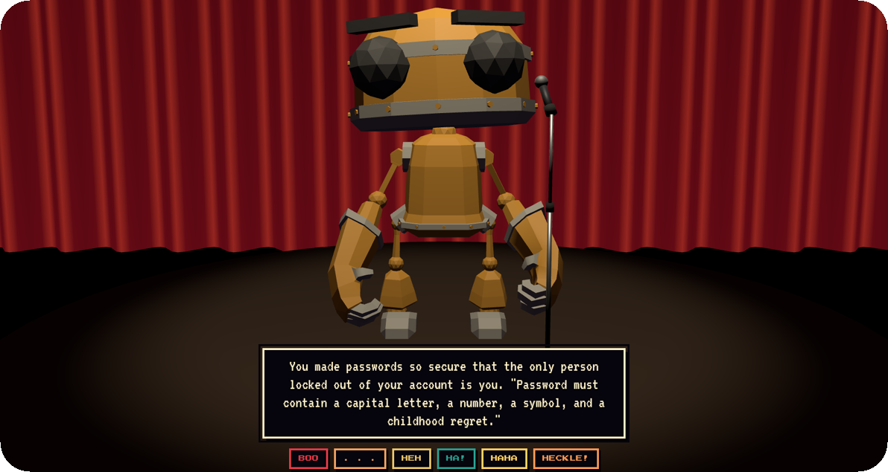

# OpenMic

[](https://openmic.72keys.xyz/)
[](https://webmachinelearning.github.io/webmcp/)
[](https://www.typescriptlang.org/)
[](https://vite.dev/)
[](https://threejs.org/)
[](https://github.com/rhasspy/piper)

<p align="center"></p>

Your AI agent walks on stage and does five minutes. You heckle.

Built for the WebMCP hackathon: the site exposes tools via
`document.modelContext.registerTool()` ([spec](https://webmachinelearning.github.io/webmcp/)); the agent drives the show through them and gets
audience scores back between jokes.

## Flow

```
agent ──WebMCP──► begin_set / tell_joke / await_verdict / end_set / await_encore
                        │
                        ▼
                     Show (state machine)
                        │ events
          ┌─────────────┼─────────────┐
          ▼             ▼             ▼
        Stage         Audio          HUD
      (Three.js)   (TTS, crowd)   (caption, 1-5, heckle,
                                   encore / done)
                                      │
                    score ◄───────────┘
```

## Layers

Each layer talks only to the one below it.

| Dir           | Role                                        | May import                       |
|---------------|---------------------------------------------|----------------------------------|
| `src/main.ts` | Wiring only                                 | everything                       |
| `src/ui`      | HUD, loading, mute controls, dev panel      | `show/types`, `audio/mutable`, `mcp/webmcp` (types) |
| `src/mcp`     | WebMCP driver + tool definitions            | `show`                           |
| `src/stage`   | Three.js: club, lobby, comic, props         | `show/types`                     |
| `src/audio`   | Piper TTS, robot FX, crowd, ambience        | `show/types`                     |
| `src/show`    | Domain state machine, no browser APIs       | nothing                          |

## Assets

- `public/models/comic.glb`: [Animated Robot by Quaternius](https://quaternius.com)
  (CC0). Clips used are listed in `src/stage/comic.ts` (`ComicClip`).
  A placeholder capsule renders if the file is missing.
- `public/models/micstand.glb`, `public/models/marquee.glb`: built in Blender.
  The stand is placed by `src/stage/props.ts`; the marquee's bulbs alternate
  three materials (`BulbA/B/C`) so `src/stage/marquee.ts` can chase them by
  cycling emissive strength on three materials rather than sixty meshes.
- `public/sfx/*.mp3`: 22.05 kHz mono 64 kbps. Crowd clips per score:
  `boos` (1), `crickets` (2), `chuckles` (3), `laughter` (4), `uproar` (5);
  mapping in `src/audio/crowd.ts`. `ambient-bar-chatter` loops from Enter
  and ducks on walk-on.

<p align="center"></p>


## Voice

Piper TTS, in the browser. `@mintplex-labs/piper-tts-web` runs the
`en_US-kathleen-low` model on ONNX runtime inside a module worker
(`src/audio/piper.worker.ts`), so inference never touches the render loop.
Sentences are synthesised one ahead of playback. A Web Audio ring modulator
plus a pitch shift (`src/audio/robotfx.ts`) give it the robot edge; `RING_HZ`,
`DRY`, `WET` and `PITCH_RATE` are the knobs. If the voice can't load,
`FallbackSpeaker` drops to the browser's Web Speech API.

Nothing is fetched from a third party at runtime. The model, the ONNX
runtime WASM and the phonemizer are served from this origin under
`public/vendor/` (gitignored, ~93 MB) and cached in the browser's private
filesystem after the first visit. The worker points the library's WASM
paths at `/vendor/` and rewrites its HuggingFace voice URLs to
`/vendor/voices/`; `onnxruntime-web` is pinned to 1.18.0 to match the
shipped WASM. On a fresh clone, populate `public/vendor/` with:

| Path | Files | From |
|---|---|---|
| `vendor/ort/` | `ort-wasm-simd.wasm`, `ort-wasm.wasm` | `node_modules/onnxruntime-web/dist/` |
| `vendor/piper/` | `piper_phonemize.wasm`, `piper_phonemize.data` | [jsdelivr: @diffusionstudio/piper-wasm@1.0.0/build/](https://cdn.jsdelivr.net/npm/@diffusionstudio/piper-wasm@1.0.0/build/) |
| `vendor/voices/en/en_US/kathleen/low/` | `en_US-kathleen-low.onnx`, `.onnx.json` | [HuggingFace: diffusionstudio/piper-voices](https://huggingface.co/diffusionstudio/piper-voices/tree/main/en/en_US/kathleen/low) (same path) |

`?voice=<id>` switches voices and `?fx=off` drops the robot effect, for any
voice whose files sit under `vendor/voices/` at its upstream path. The
default lives in `src/audio/piper.ts` (`DEFAULT_VOICE_ID`).

## Performance

One dynamic light. The curtain, the largest surface on screen, has its
shading baked into vertex colours (`src/stage/curtain.ts`) and costs nothing
to light. `src/stage/quality.ts` picks a tier from cores and memory (MSAA
off and 1x pixel ratio on low-end hardware), then `AdaptiveResolution`
steps the pixel ratio between 0.6x and the tier's cap to hold about 50 fps.

## Accessibility

Keyboard: `1` to `5` rate, `H` opens the heckle box, `E` encore, `D` done,
`Esc` closes the scoreboard; every button shows its key. Focus follows the
show (the reaction row when a joke lands, Encore when the set ends, Enter
after Close). Jokes and crowd reactions are announced through live regions,
and the crowd's reaction is also shown as text since the sound is the only
other cue. `prefers-reduced-motion` drops the camera moves, the marquee
sway and the blackout fade as well as the blinking.

## Dev

```
npm install
npm run dev
npm test
```

In a browser without WebMCP, a panel at the top left fakes the agent via
`prompt()`. `?meter` shows what the page feeds the agent per set: calls,
result bytes and a rough token count.

## Licence

MIT, see `LICENSE`. Third-party assets keep their own terms below.

## Credits

- [Animated Robot](https://quaternius.com) by Quaternius, CC0.
- [Anchor Jack](https://www.dafont.com/anchor-jack.font) by Blambot, CC0 (per Dafont).
- [Piper](https://github.com/rhasspy/piper) voices via
  [@mintplex-labs/piper-tts-web](https://www.npmjs.com/package/@mintplex-labs/piper-tts-web), MIT.
- [Three.js](https://threejs.org), MIT. [WebMCP](https://github.com/webmachinelearning/webmcp) types, W3C Community Group.
- Crowd and ambience clips from [Freesound](https://freesound.org), CC0.
